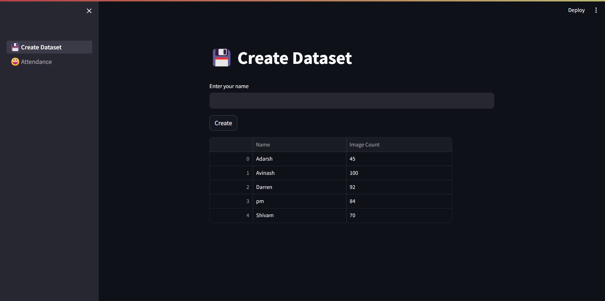
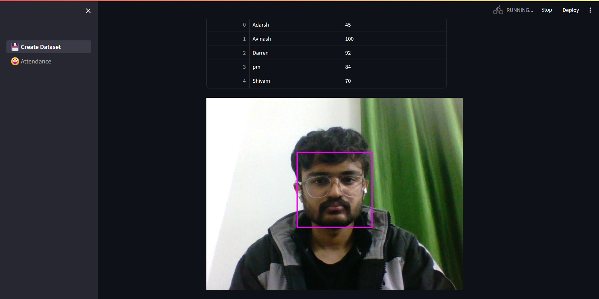
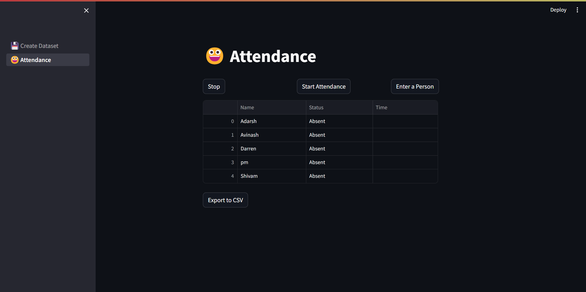
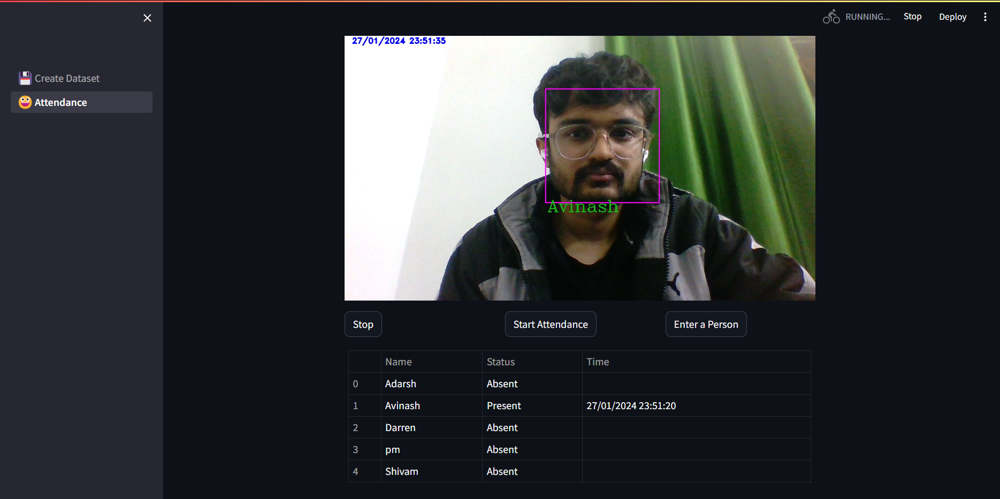

# Attendance
## Final Project for the workshop PySight2.0

A live attendance system based on Face Recognition.

I have used the `haarcascade_frontalface_default.xml` as the face detection structure for the  project. The code is written in Python and uses OpenCV library to perform real-time face recognition
I have used `streamlit` to make the GUI, Web Interface, for the project.

The project is divided into two parts:
1. Creating a Dataset for the student/person
2. Detecting the student/person and putting their attendance

### 1. Creating the Dataset.
The dataset will be created using OpenCV, which provides functionalities to capture video from webcam

1. First the current available Datasets are listed with the number of images available for them using a DataFrame.
2. Then the user is supposed to input the name of the student whose dataset is to be created. (Taken using streamlit elements)
3. Then using `cv2.CascadeClassifier(haar_file)`, We identify the face in the captured image from the webcam.
4. After capturing the face, we crop it, resize it and grayscale it to match the rest of the images in the dataset.
5. Then we store all the images captured into the directory.

### 2. Face Detection and Attendance
Using the same camera as mentioned above, we detect the faces again but this time we compare it with our dataset (images of students). If there is any match found then we mark that person's Attendance
1. First we initialize the GUI with a dataframe of all available students, initially marked as Absent.
2. Then we load all the available images from the dataset into a list  named 'images'.
3. Then once "Take Attendance" button is used, The  camera starts capturing frames from the webcam.
4. These images are compared with the images in the dataset and the matching student's name is displayed with a box around the face.
5. Then the attendance is marked as Present, accordingly along with the timestamp

- This data can also be exported as a csv file to display it in excel.


### Screenshots

Create Dataset

Capturing Dataset

Initial Attendance

Taken Attendance

### Output CSV
```csv
Name,Status,Time
Adarsh,Absent,
Avinash,Present,27/01/2024 23:51:20
Darren,Absent,
pm,Absent,
Shivam,Absent,
```

