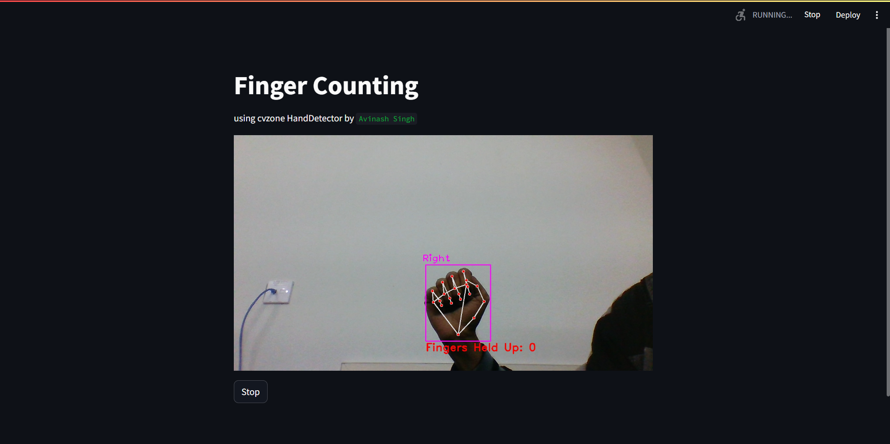
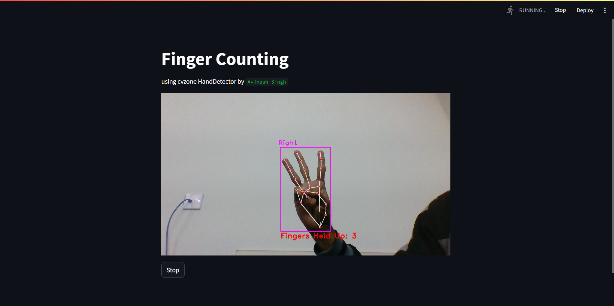
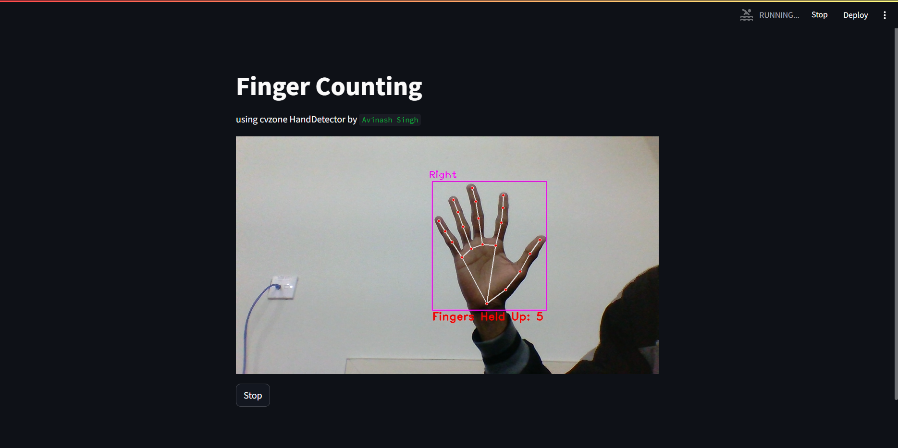

# Finger Counting
## Final Project for the workshop PySight2.0

This is a simple project where the camera can detect how many fingers can held up.

I have used the `HandDetector` from the `HandTrackingModule` of `cvzone`
```py
from cvzone.HandTrackingModule import HandDetector
```

The main function of this project is to take camera input and detect how many fingers are held up and return a feed with a bounding box drawn over it.

I have made the GUI, web interface, of the app using `streamlit`

### Steps followed in the code
1. Initialize Video Capturing using `cv2.VideoCapture(0)`
2. Set up the Framework for the GUI using streamlit
3. Initialize the HandDetector model
4. Find Hands using `.findHands()` method.
5. Get the number of fingersUp using the `.fingerUp()` method and `.count()` method.
6. Display it on the screen.

### Screenshots

0 Fingers up

3 Fingers up

5 Fingers up
